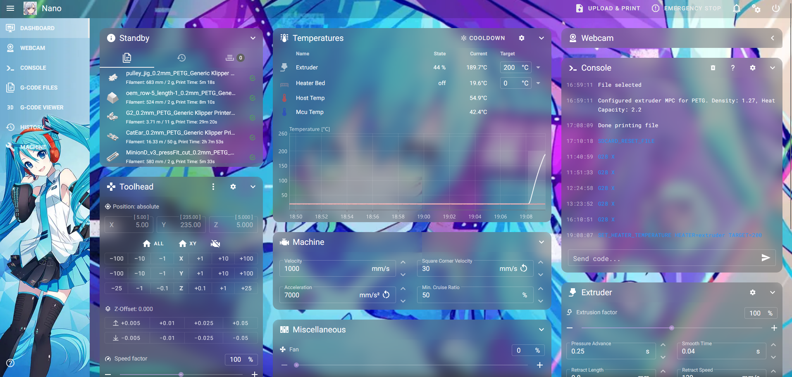

# Miku-sail

Theme with our beloved Hatsune Miku :3



*Fluidd has it's quirks, use at your own will*

Make a `.theme` folder(for mainsail), or a `.fluidd-theme`(for fluidd) and paste all the files in there.

OR

Delete the .theme and paste this into an ssh dialog for mainsail:
```
git clone https://github.com/Suzu0071/Miku-sail ~/printer_data/config/.theme
```
For fluidd:
```
git clone https://github.com/Suzu0071/Miku-sail ~/printer_data/config/.fluidd-theme
```
If you use this somewhere, cite it with my ugly face c:

With love, from Suzuki

UwU
